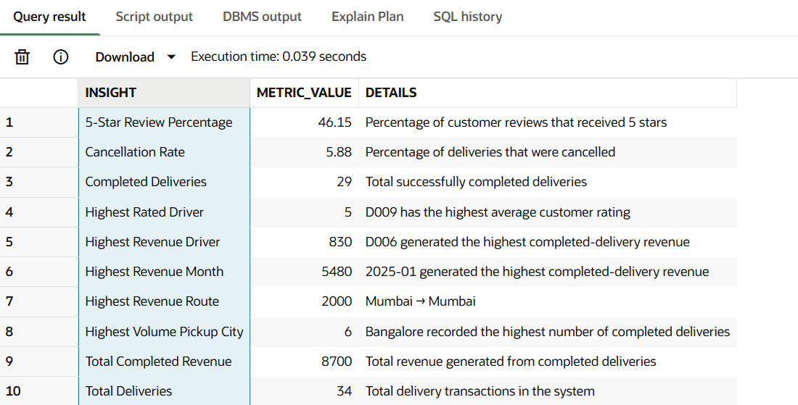

# 🚚 Delivery & Logistics Management System – SQL Project

## 📌 Project Overview

This project is a SQL-based **Delivery & Logistics Management System** developed to analyze delivery operations, driver performance, vehicle information, customer reviews, payments, revenue, routes, and delivery efficiency.

The project demonstrates how SQL can be used to transform raw operational data into meaningful business insights that support data-driven decision making.

The project follows a complete data analysis workflow:

- Database creation
- Raw data loading
- Data cleaning
- Data validation
- Table relationships
- Business analysis
- Advanced SQL analysis
- KPI analysis
- Business insights
- Business recommendations

---

# 📊 Final Business KPIs

The following KPIs were generated from the cleaned delivery dataset using SQL.



| KPI | Result |
|---|---:|
| Total Deliveries | 34 |
| Completed Deliveries | 29 |
| Cancellation Rate | 5.88% |
| Total Completed Revenue | 8,700 |
| Highest Revenue Driver | D006 |
| D006 Revenue | 830 |
| Highest Volume Pickup City | Bangalore |
| Bangalore Completed Deliveries | 6 |
| Highest Revenue Route | Mumbai → Mumbai |
| Mumbai → Mumbai Revenue | 2,000 |
| Highest Revenue Month | January 2025 |
| January 2025 Revenue | 5,480 |
| Highest Rated Driver | D009 |
| D009 Average Rating | 5.0 |
| Five-Star Review Percentage | 46.15% |

---

# 🎯 Business Problem

A delivery and logistics company needs to understand its operational and financial performance.

The company wants to answer questions such as:

- Which drivers are performing best?
- Which drivers generate the most revenue?
- Which drivers have the highest completion rate?
- Which drivers have high cancellation rates?
- Which cities have the highest delivery volume?
- Which routes generate the most revenue?
- Which routes have longer delivery distances?
- How efficient are deliveries?
- How satisfied are customers?
- Which drivers receive the highest customer ratings?
- Which payment methods generate the most revenue?
- How does driver revenue change over time?
- Which drivers perform above or below their city average?

The objective of this project is to answer these business questions using SQL and convert the results into actionable business insights.

---

# 🎯 Project Objectives

The main objectives of this project are:

1. Build a relational delivery and logistics database.
2. Load and analyze raw operational data.
3. Identify and clean data-quality issues.
4. Validate relationships between tables.
5. Analyze driver performance.
6. Analyze delivery operations.
7. Analyze revenue and payments.
8. Analyze customer satisfaction.
9. Analyze cities and delivery routes.
10. Perform advanced SQL analysis.
11. Generate meaningful business KPIs.
12. Convert SQL results into business insights and recommendations.

---

# 🗄️ Database Structure

The project contains **five main operational tables** and **one combined analytical table**.

## 1. Drivers

Stores information about delivery drivers.

### Important Columns

| Column | Description |
|---|---|
| driver_id | Unique driver identifier |
| driver_name | Driver name |
| gender | Driver gender |
| age | Driver age |
| city | Driver's city |
| joining_date | Driver joining date |
| rating | Driver rating |

---

## 2. Vehicles

Stores information about vehicles used for deliveries.

### Important Columns

| Column | Description |
|---|---|
| vehicle_id | Unique vehicle identifier |
| driver_id | Driver assigned to vehicle |
| vehicle_type | Type of vehicle |
| vehicle_model | Vehicle model |
| fuel_type | Fuel type |
| capacity | Vehicle capacity |

---

## 3. Deliveries

Stores delivery transaction information.

### Important Columns

| Column | Description |
|---|---|
| delivery_id | Unique delivery identifier |
| driver_id | Driver handling the delivery |
| vehicle_id | Vehicle used for delivery |
| customer_id | Customer identifier |
| pickup_city | Delivery pickup location |
| delivery_city | Delivery destination |
| delivery_date | Delivery date |
| distance_km | Delivery distance |
| delivery_time_minutes | Delivery time |
| delivery_status | Delivery status |

---

## 4. Delivery Payments

Stores payment and revenue information.

### Important Columns

| Column | Description |
|---|---|
| payment_id | Unique payment identifier |
| delivery_id | Related delivery |
| delivery_charge | Customer delivery charge |
| driver_payment | Payment made to driver |
| company_commission | Company commission |
| payment_method | Payment method |

---

## 5. Delivery Reviews

Stores customer feedback and ratings.

### Important Columns

| Column | Description |
|---|---|
| review_id | Unique review identifier |
| delivery_id | Related delivery |
| customer_id | Customer identifier |
| rating | Customer rating |
| review_date | Review date |
| feedback | Customer feedback |

---

## 6. Combined Delivery Data

A consolidated table created by joining the operational tables.

This table combines driver, vehicle, delivery, payment, and customer review information into a single analytical dataset.

---

# 🔗 Table Relationships

The tables are connected through logical relationships using SQL `JOIN` operations.

```text
                    DRIVERS
                       |
                    driver_id
                       |
                       ↓
                  DELIVERIES
                 /     |      \
                /      |       \
               ↓       ↓        ↓
          VEHICLES   PAYMENTS   REVIEWS
